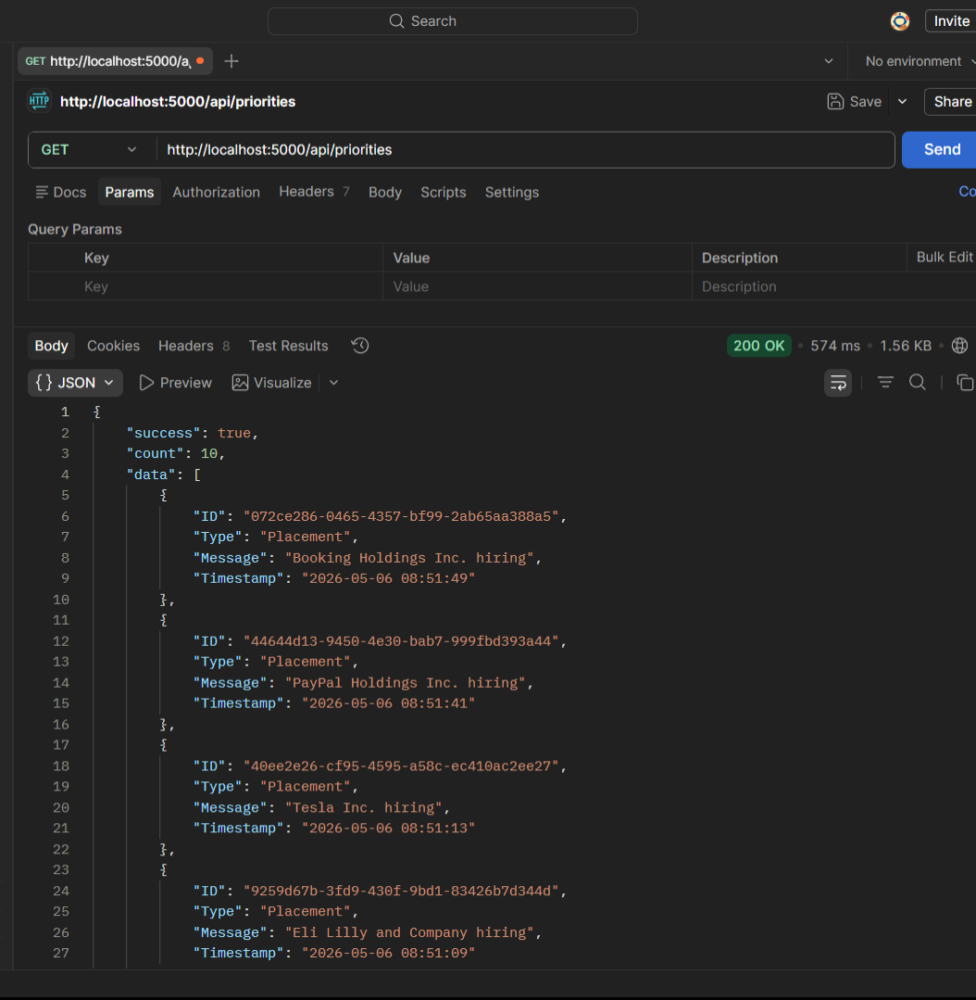
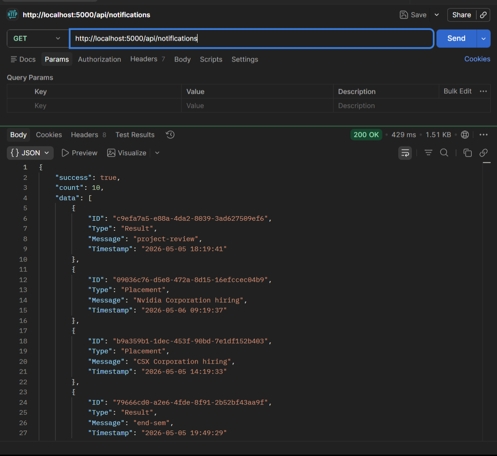
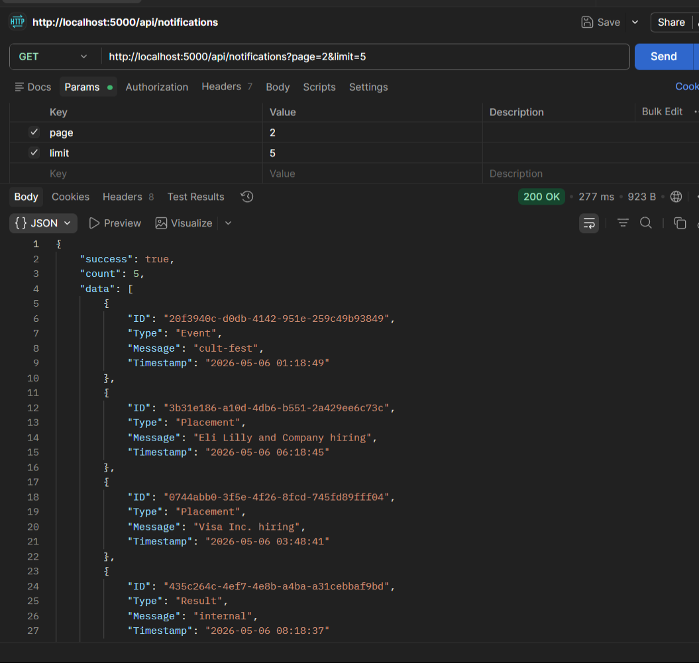
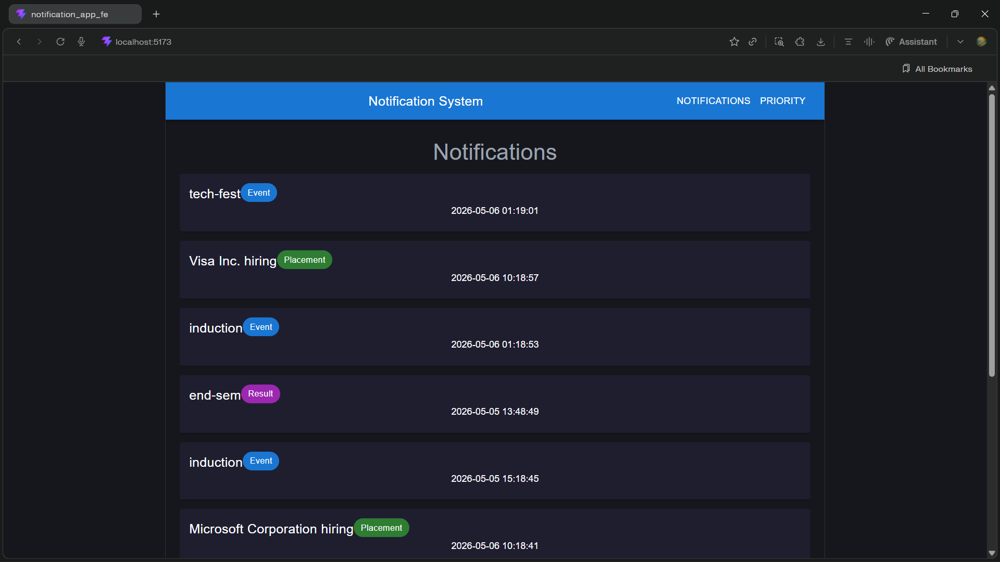
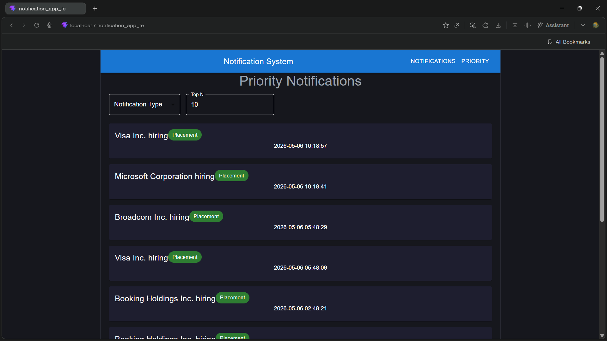
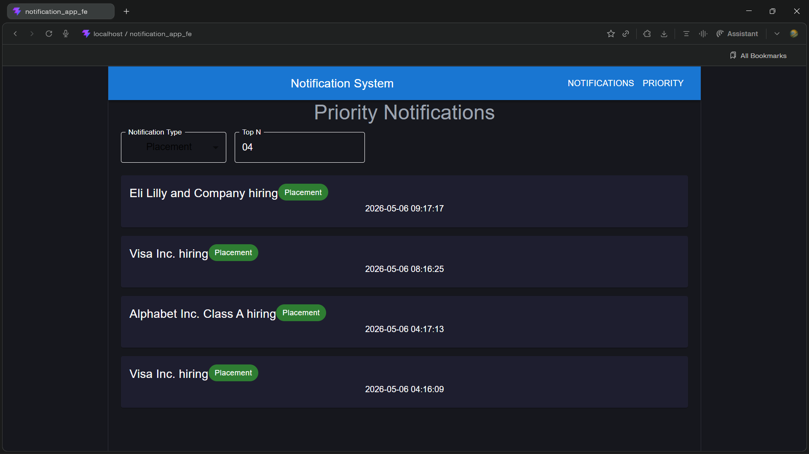
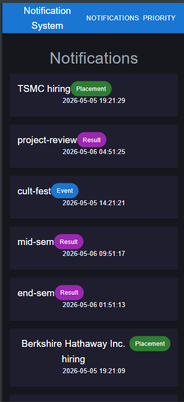
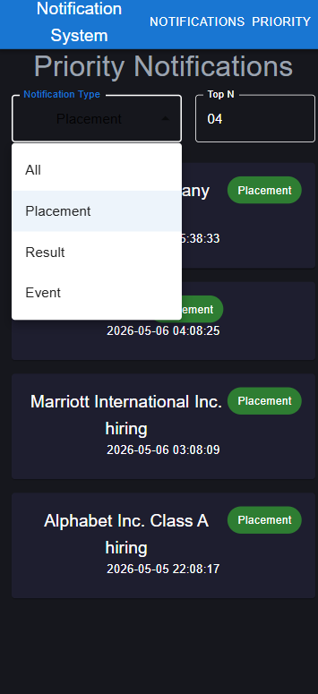
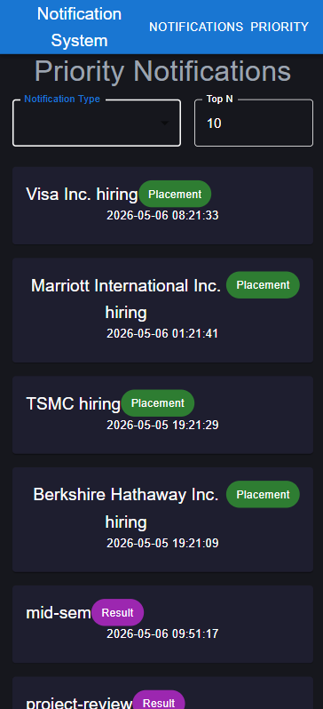

# Stage 1

## Notification System REST API Design

### 1. Get All Notifications

#### Endpoint

```http
GET /api/notifications
```

#### Query Parameters

| Parameter | Type | Description |
|---|---|---|
| page | number | Pagination page |
| limit | number | Number of notifications |
| notification_type | string | Event / Result / Placement |

#### Response

```json
{
  "success": true,
  "count": 10,
  "data": [
    {
      "ID": "123",
      "Type": "Placement",
      "Message": "Microsoft hiring",
      "Timestamp": "2026-05-06 10:00:00"
    }
  ]
}
```

---

### 2. Get Priority Notifications

#### Endpoint

```http
GET /api/priorities
```

#### Query Parameters

| Parameter | Type | Description |
|---|---|---|
| limit | number | Top N notifications |

#### Response

```json
{
  "success": true,
  "count": 5,
  "data": []
}
```

---

### Headers

```http
Content-Type: application/json
Authorization: Bearer <token>
```

---

### Notification Types

- Placement
- Result
- Event

---

### Pagination Mechanism

Pagination is implemented using:
- page
- limit

This reduces server load and improves frontend performance.

---

# Stage 2

## Database Choice

I would use PostgreSQL as the primary database because:

- Strong ACID compliance
- Better indexing support
- Efficient querying
- Reliable relational structure
- Scalable for large datasets

---

## Database Schema

### students

| Column | Type |
|---|---|
| id | BIGINT |
| name | VARCHAR |
| email | VARCHAR |

---

### notifications

| Column | Type |
|---|---|
| id | UUID |
| studentID | BIGINT |
| notificationType | ENUM |
| message | TEXT |
| isRead | BOOLEAN |
| createdAt | TIMESTAMP |

---

## Problems at Scale

As data increases:
- Slow queries
- High DB load
- Increased API latency

---

## Solutions

- Proper indexing
- Pagination
- Query optimization
- Redis caching
- Read replicas
- Archiving old notifications

---

## Example SQL Query

```sql
SELECT *
FROM notifications
WHERE studentID = 1042
ORDER BY createdAt DESC
LIMIT 10;
```

---

# Stage 3

## Query Analysis

### Given Query

```sql
SELECT * FROM notifications
WHERE studentID = 1042 AND isRead = false
ORDER BY createdAt ASC;
```

---

## Problems

The query becomes slow because:
- Full table scans
- Large dataset size
- Missing indexes
- Sorting overhead

---

## Better Solution

Use composite indexing:

```sql
CREATE INDEX idx_notifications_student_read_created
ON notifications(studentID, isRead, createdAt);
```

---

## Complexity

### Without Index

```txt
O(n)
```

### With Composite Index

```txt
O(log n)
```

---

## Should We Index Every Column?

No.

Problems:
- Increased storage
- Slower inserts/updates
- Unnecessary maintenance overhead

Indexes should only be added for frequently queried columns.

---

## Placement Notification Query

```sql
SELECT DISTINCT studentID
FROM notifications
WHERE notificationType = 'Placement'
AND createdAt >= NOW() - INTERVAL '7 days';
```

---

# Stage 4

## Performance Improvement Strategy

Currently notifications are fetched on every page load which overloads the database.

---

## Solutions

### 1. Redis Caching

Frequently accessed notifications can be cached.

Advantages:
- Faster responses
- Reduced DB load

Tradeoff:
- Cache invalidation complexity

---

### 2. Pagination

Load notifications in smaller chunks.

Advantages:
- Lower API response size
- Better frontend performance

Tradeoff:
- More API requests

---

### 3. Lazy Loading

Load notifications only when required.

Advantages:
- Reduced initial load

Tradeoff:
- Additional frontend complexity

---

### 4. Read Replicas

Use read-only DB replicas.

Advantages:
- Better scalability

Tradeoff:
- Replication lag

---

# Stage 5

## Problems with Existing Implementation

Problems:
- Sequential processing
- Slow execution
- Failure handling issues
- Poor scalability

If email sending fails midway, partial delivery occurs.

---

## Better Architecture

Use:
- Queue-based processing
- Background workers
- Retry mechanism

---

## Should DB Save and Email Send Happen Together?

No.

Database persistence and email delivery should be separated.

Reason:
- Email systems may fail
- DB operations should remain reliable

---

## Improved Pseudocode

```txt
function notify_all(student_ids, message):

    save_notifications_to_db(student_ids, message)

    push_to_queue(student_ids, message)

worker():

    while queue_not_empty:

        student = get_next_job()

        try:
            send_email(student)
            send_in_app_notification(student)

        catch error:
            retry_job(student)
```

---

# Stage 6

## Priority Inbox Design

Priority is determined using:
- Notification type weight
- Recency

Priority order:
1. Placement
2. Result
3. Event

---

## Current Implementation

Notifications are:
- sorted by priority weight
- then sorted by latest timestamp

Complexity:

```txt
O(n log n)
```

---

## Better Optimization

Use a min-heap of size 10.

Complexity:

```txt
O(n log k)
```

Where:
- n = total notifications
- k = top notifications required

---

## Efficient Maintenance of Top 10

Whenever new notifications arrive:
- compare with heap root
- replace lower priority items
- maintain heap size = 10

This avoids sorting the entire dataset repeatedly.

# Output Screenshots

## Backend API Testing

### Notifications API


### Priority Notifications API


### Filter API Test


---

## Desktop UI

### Notifications Page


### Priority Notifications Page


### Filter Working


### Top N Notifications


---

## Mobile UI

### Mobile Notifications Page


### Mobile Priority Page


### Mobile Filter / Top N
